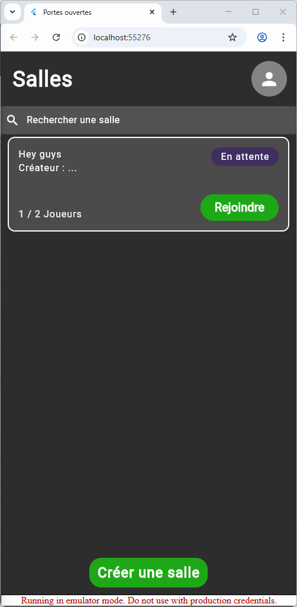
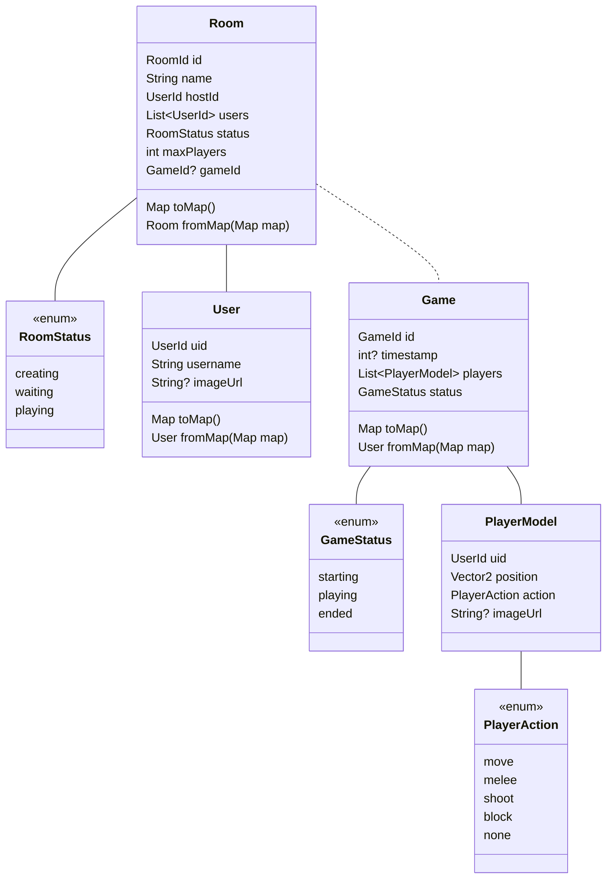

# Portes ouvertes
Projet pour les portes ouvertes du CEFF.

Le but du projet est de réaliser un jeu en ligne, avec des salles de jeu et un jeu pour chaque salle.

## But du jeu
Tous les joueurs sont placés dans une grille et ont le choix entre 4 actions :
- Se déplacer
- Attaque proche
- Attaque à distance
- Se protéger

Chaque joueur choisit son action et le but est d'être le dernier survivant.
# Classes

# Fonctionnalités
- [X] Lister les salles présentes
- [X] Créer une salle
- [X] Afficher les détails d'une salle
- [X] Afficher le status d'une salle
- [X] Afficher les joueurs d'une salle
- [X] Afficher les photos de profil des joueurs d'une salle
- [X] Afficher le créateur d'une salle
- [X] Se connecter
- [X] Rejoindre une salle
- [X] Quitter une salle
- [X] Lancer le jeu
- [X] Participer
- [X] Regarder la partie une fois mort
# Fonctionnement jeu
Le challenge de développement a été de préparer un jeu qui connecte tous les joueurs sans serveur central externe pour gérer le tout.

## Notre solution
Nous avons utilisé les Streams pour permettre aux joueurs de surveiller le jeu en cas de changement. Un stockage externe pour le jeu est disponible. En utilisant des status + les streams, chaque joueur envoie un message quand il a réalisé une action et le stockage va se limiter à la première requête qu'il reçoit.

Voici des exemples de messages que nous utilisons :
- Début du jeu
- Début du round
- Action choisie
- Mettre à jour les joueurs (fin de round)
- Fin de jeu

# Émulateurs
Le projet utilise des émulateurs pour développer de tout.
## Mise en place
1. `mkdir backend`
2. `cd backend`
3. `firebase emulators:start`

Note : Si la commande firebase n'est pas reconnue, `npm i -g firebase_tools`