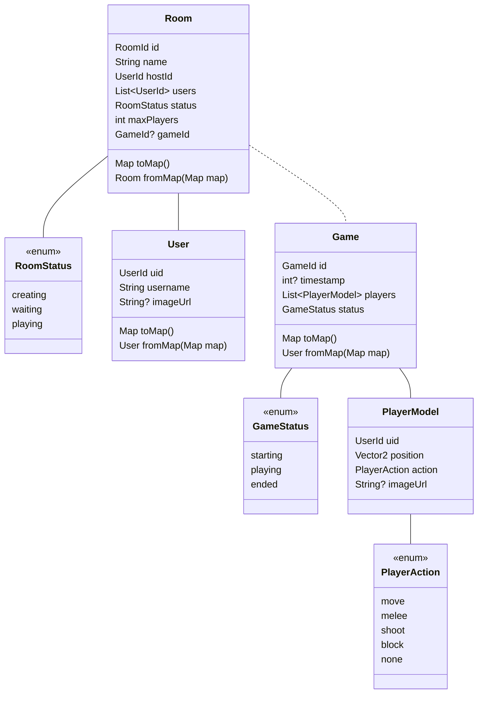

# Portes ouvertes
Projet pour les portes ouvertes du CEFF.  
But :  Créer un  jeu interractif sur mobile en utilisant Flutter
# Classes

# Fonctionnalités
- [X] Lister les salles présentes
- [X] Créer une salle
- [X] Afficher les détails d'une salle
- [X] Afficher le status d'une salle
- [X] Afficher les joueurs d'une salle
- [ ] Afficher les photos de profil des joueurs d'une salle
- [X] Afficher le host d'une salle
- [X] Se connecter
- [X] Rejoindre une salle
- [X] Quitter une salle
- [ ] Lancer le jeu
- [ ] Participer
- [ ] Regarder la partie une fois mort
# Émulateurs
Le projet utilise des émulateurs pour développer de tout.
## Mise en place
1. `mkdir backend`
2. `cd backend`
3. `firebase emulators:start`

Note : Si la commande firebase n'est pas reconnue, `npm i -g firebase_tools`