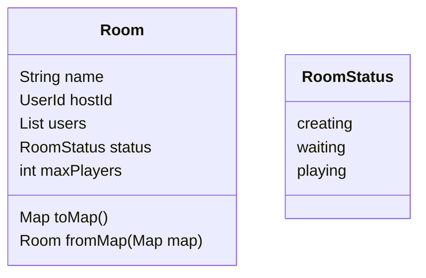

# Portes ouvertes
Projet pour les portes ouvertes du CEFF.  
But :  Créer un  jeu interractif sur mobile en utilisant Flutter
# Classes

# Fonctionnalités
- [ ] Lister les salles présentes
- [ ] Créer une salle
- [ ] Afficher les détails d'une salle
- [ ] Afficher les joueurs d'une salle
- [ ] Afficher le host d'une salle
- [ ] Se connecter
# Émulateurs
Le projet utilise des émulateurs pour développer de tout.
## Mise en place
1. `mkdir backend`
2. `cd backend`
3. `firebase emulators:start`

Note : Si la commande firebase n'est pas reconnue, `npm i -g firebase_tools`